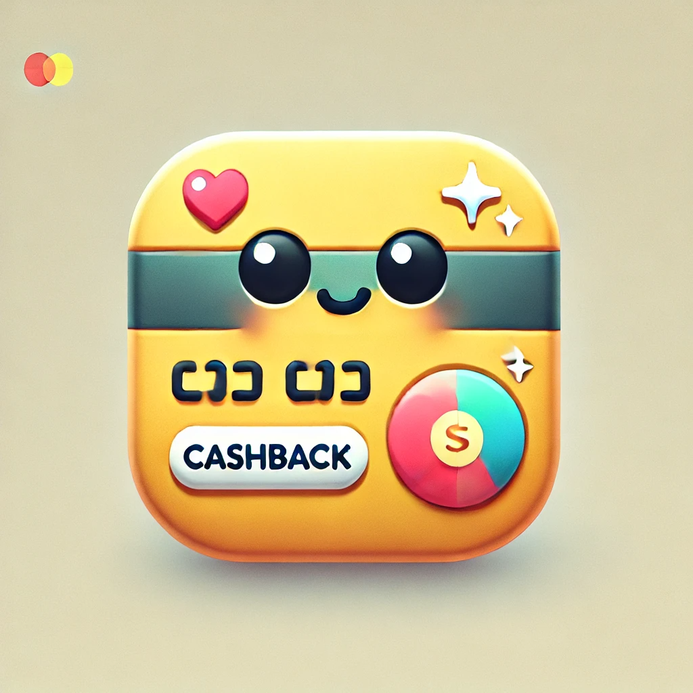
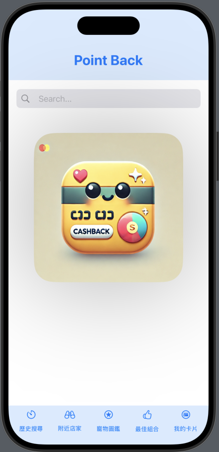

# Point-Back

 

## 簡介 (Introduction)

PointBack 是一個用 SwiftUI 開發的 iOS 應用程式，旨在幫助用戶管理和查詢各種商家的回饋資訊。<br>
用戶可以新增自己的卡片，並根據不同商家的回饋等級顯示相應的圖片和資訊。

PointBack is an iOS application developed with SwiftUI, designed to help users manage and query various merchant reward information. <br>
Users can add their own cards and display corresponding images and information based on different merchant reward levels.

[簡報/Slide](https://drive.google.com/file/d/1-xG6vwQjanc0DuwJfx8D6lRAt4CIHyFq/view?usp=sharing)

按下圖片即可觀看操作影片<br>
Click on the picture to watch the operation video

[](https://youtube.com/shorts/3rYddOJ4sMc?feature=share "Point-Back")

## 功能 (Features)

- 寵物圖鑑 (Pet book)
- 搜尋歷史紀錄 (Search history)
- 管理用戶卡片 (Manage user cards)
- 顯示附近商店 (Display nearby stores)
- 顯示最佳組合 (Display best combination)
- 分析卡片最佳回饋資訊 (Analyze the best reward information for cards)

## 專案結構 (Project Structure)

```
Card_Image/
    Images
PetImage/
    Images
PointBack/
    BestCombinationView.swift
    ContentView.swift
    HistorySearchView.swift
    MyCardView.swift
    NearbyStoresView.swift
    PetBooksView.swift
    PointBackApp.swift
README.md
```

## 安裝與使用 (Installation and Usage)

1. 複製此專案 (Clone this repository):

    ```sh
    git clone https://github.com/yourusername/PointBack.git
    ```

2. 打開 Xcode 並載入專案 (Open Xcode and load the project):

    ```sh
    open PointBack/PointBack.xcodeproj
    ```

3. 選擇模擬器，然後運行專案 (Select a simulator or connect a real device, then run the project).

## 主要檔案 (Main Files)

- [PointBackApp.swift](PointBack/PointBackApp.swift): 應用程式的入口 (Entry point of the application)
- [ContentView.swift](PointBack/ContentView.swift): 主要的視圖 (Main view)
- [BestCombinationView.swift](PointBack/BestCombinationView.swift): 最佳組合視圖 (Best combination view)
- [HistorySearchView.swift](PointBack/HistorySearchView.swift): 搜尋歷史視圖 (History search view)
- [MyCardView.swift](PointBack/MyCardView.swift): 我的卡片視圖 (My card view)
- [NearbyStoresView.swift](PointBack/NearbyStoresView.swift): 附近商店視圖 (Nearby stores view)
- [PetBooksView.swift](PointBack/PetBooksView.swift): 寵物圖鑑視圖 (Pet books view)

## 貢獻 (Contributing)

歡迎任何形式的貢獻！請先 fork 此專案，並建立一個新的分支來進行修改。完成後，請提交一個 pull request。

Contributions are welcome! Please fork this repository and create a new branch for your changes. Once completed, submit a pull request.

## 授權 (License)

此專案採用 MIT 授權。詳情請參閱 [LICENSE](https://en.wikipedia.org/wiki/MIT_License) 文件。

This project is licensed under the MIT License.<p>
See the [LICENSE](https://en.wikipedia.org/wiki/MIT_License) file for details.